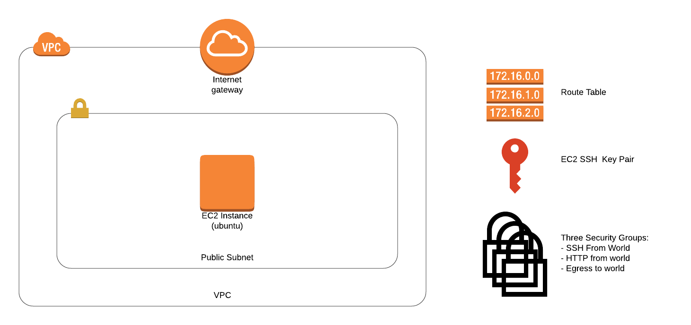

# Terraform/Ansible Demo

## Overview
This demo illustrates using Terraform and Ansible together to stand up a simple infrastructure. In particular we will:

- Use Terraform to stand up an EC2 instance in AWS from scratch, including all the networking needed to make it accessible from the internet
- Use Ansible to Install the NginX web server on the instance
- Confirm we can browse to the default NginX welcome page

## Prerequisites
Tools
- Ansible ([instructions](https://docs.ansible.com/ansible/latest/installation_guide/intro_installation.html))
- Terraform ([instructions](https://learn.hashicorp.com/terraform/getting-started/install.html))
- The AWS CLI ([instructions](https://docs.aws.amazon.com/cli/latest/userguide/cli-chap-install.html))

Accounts/Credentials
- An AWS account ([instructions](https://aws.amazon.com/premiumsupport/knowledge-center/create-and-activate-aws-account/))
- An AWS keypair with admin perms in `~/.aws/credentials` ([instructions](https://docs.aws.amazon.com/cli/latest/userguide/cli-chap-configure.html))
- A SSH keypair in `~/.ssh/id_rsa` ([instructions](https://confluence.atlassian.com/bitbucketserver/creating-ssh-keys-776639788.html))

## Note about AWS costs
Standing up this stack may incur charges on your AWS account. Be sure to tear it down when you're done, so it doesn't add up.

## Architecture Diagram
Here's a diagram of the infrastructure we'll be standing up:



## Terraform overview
Here's an overview of the terraform code we'll be using

```
ansible-terraform-demo
|- terraform
|  |- basic
|  |  |- terraform.tfvars
|  |  |- variables.tf
|  |  |- main.tf
|  |  |- (terraform.tfstate) # <-- temporary file
|  |- advanced
|  |  |- ...
|- ansible
|  |- ...
```

## Stand up the infrastructure
Now let's use Terraform to stand up the infrastructure

```
> cd terraform/basic
> terraform init
> terraform plan
> terraform apply
```

#### Note the Terraform state file
Normally we would configure Terraform to save the state file in S3 so others may access it, but for demo purposes we'll let Terraform default to saving it locally.
```
> cat terraform.tfstate
```

## View the EC2 instance in the AWS CLI
```
> aws ec2 describe-instances
```

## Grab the public IP of the instance
...so we can use it later
```
> ip=`terraform output | grep ip | awk '{ print $3 }'`
```

## Confirm you can SSH to the instance
We'll need SSH to work, because that's how Ansible will connect to install the web server
```
> ssh ubuntu@$ip
```

## Overview of the Ansible code
Now we'll install NginX on the EC2 instance using Ansible. Here's the code we'll be using

```
ansible-terraform-demo
|- terraform
|  |- ...
|- ansible
|  |- main.yml
```

## Install NginX using Ansible
Let's go ahead and run the playbook against the instance we just created.

```
> cd ../ansible
> ansible-playbook -u ubuntu -i "$ip," main.yml
```

## Browse
You can curl on the command line, or paste the IP in your browser
```
> curl $ip
```

## Teardown
Be sure to tear down your infrastructure when you're done, so you don't incur AWS costs.
```
> cd ../terraform
> terraform destroy
```

Optional: remove the local Terraform state
```
> rm -r .terraform terraform.tfstate
```

## Advanced Demo

The "advanced" Terraform version uses modules and remote state. It should work the same way, except you'll need to run `terraform/advanced/tfstate/main.yml" first to set up the S3 bucket and dynamo table.

#### Files in the Advanced demo
```
ansible-terraform-demo
|- terraform
|  |- basic
|  |  |- ...
|  |- advanced
|  |  |- tfstate
|  |  |  |- terraform.tfvars
|  |  |  |- variables.tf
|  |  |  |- main.tf
|  |  |  |- (terraform.tfstate) # <-- temporary file
|  |  |- spaelet
|  |  |  |- terraform.tfvars
|  |  |  |- variables.tf
|  |  |  |- main.tf
|  |  |- modules
|  |  |  |- vpc
|  |  |  |- private_subnet
|  |  |  |- ec2
|- ansible
|  |- ...
```
